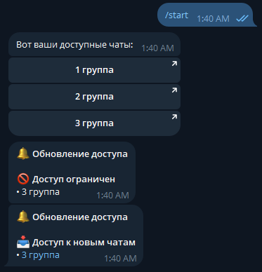

# AutoControlBot

AutoControlBot — телеграм-бот для автоматизации выдачи доступа в рабочие чаты на основе данных из Google Sheets.

## 📸 Скриншоты интерфейса



## 🚀 Возможности

- Синхронизация списка пользователей и чатов из Google Sheets.
- Автоматическое обновление кэша и мгновенные уведомления о новых доступах.
- Проверка наличия пользователя в таблице перед выдачей доступа.
- Удобный выбор чатов через инлайн-кнопки.
- Гибкая конфигурация через переменные окружения.

## 🧩 Архитектура

```
src/
├── main.py             # Точка входа, запуск фоновых задач
├── bot.py              # Инициализация aiogram Bot и Dispatcher
├── handlers/           # Обработчики команд и кнопок
├── services/           # Работа с Google Sheets, уведомления, права доступа
├── storage/            # Локальный кэш пользователей
└── utils/              # Журналирование и вспомогательные утилиты
```

### Основные компоненты

- **Google Sheets интеграция** (`services/gsheets.py`): чтение таблицы, отслеживание изменений и валидация данных.
- **Фоновое автообновление** (`services/updater.py`): регулярная проверка таблицы, обновление кэша и рассылка уведомлений.
- **Управление жизненным циклом бота** (`services/bot_runner.py`): корректное завершение с обработкой сигналов.
- **Обработчики команд** (`handlers/start.py`): приветствие пользователя и выдача доступных чатов.

Добавьте при необходимости дополнительные пояснительные схемы и вставьте их в раздел выше.

## 🛠️ Требования

- Python 3.13+
- Установленные зависимости из `requirements.txt`
- Токен телеграм-бота (`BOT_TOKEN`)
- Ссылка на таблицу Google Sheets (`GOOGLE_SHEETS_URL`)
- JSON с сервисным аккаунтом Google (`service_account.json`)

## ⚙️ Подготовка окружения

1. Скопируйте шаблон переменных окружения:
   ```bash
   cp .env.example .env
   ```
   > Создайте файл `.env`, если шаблона нет. Минимально требуется указать `BOT_TOKEN` и `GOOGLE_SHEETS_URL`.
2. Поместите файл `service_account.json` (например, `autocontrolbot-fc7ddbebdf3b.json`) в корень проекта или измените путь через `GOOGLE_CREDS_PATH`.
3. Установите зависимости:
   ```bash
   pip install -r requirements.txt
   ```

## 🔑 Настройка Google Cloud и таблицы

1. Создайте сервисный аккаунт в [Google Cloud Console](https://console.cloud.google.com/), выдайте ему роль **Editor** (или более строгую по необходимости) и сохраните JSON-ключ. Именно этот файл (`autocontrolbot-fc7ddbebdf3b.json`) нужно передать боту через переменную `GOOGLE_CREDS_PATH`.
2. Включите API Google Sheets и Google Drive для проекта, чтобы сервисный аккаунт мог читать таблицу.
3. Откройте вашу таблицу Google Sheets и добавьте email сервисного аккаунта в список тех, кому предоставлен доступ «Editor».
4. Пропишите в `.env`:
   ```env
   GOOGLE_CREDS_PATH=autocontrolbot-fc7ddbebdf3b.json
   GOOGLE_SHEETS_URL=https://docs.google.com/spreadsheets/d/...
   ```
   Если ключ лежит в другом месте, укажите полный путь. Без доступа сервисного аккаунта бот не сможет читать таблицу и выдавать доступы.

## ▶️ Запуск локально

```bash
python src/main.py
```

## 🐳 Запуск в Docker

1. Скопируйте `service_account.json` рядом с `Dockerfile`.
2. Заполните переменные окружения в `.env` (или экспортируйте их в shell).
3. Соберите и запустите контейнер:
   ```bash
   docker compose up --build
   ```

## 🔄 Автообновление данных

- Каждые несколько секунд бот проверяет таблицу на изменения (`services/updater.py`).
- Изменения кэша записываются в `storage/cache.json`.
- Пользователи получают уведомления о новых чатах и ролях через сервис уведомлений (`services/notifier.py`).

При необходимости добавьте скриншоты/видео с демонстрацией обновлений в раздел «Скриншоты интерфейса» выше.

## 📂 Структура данных Google Sheets

| Колонка    | Описание                                      |
| ---------- | --------------------------------------------- |
| `tg_id`    | Telegram ID пользователя (обязательное поле). |
| `username` | Юзернейм без `@`.                             |
| `fio`      | ФИО или отображаемое имя.                     |
| `role`     | Роль пользователя.                            |
| `chats`    | Список ID чатов через запятую.                |

Бот автоматически нормализует данные и игнорирует некорректные строки.
